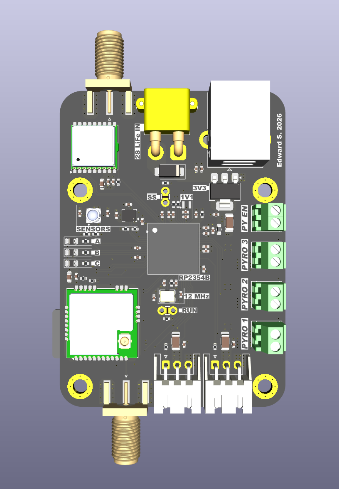
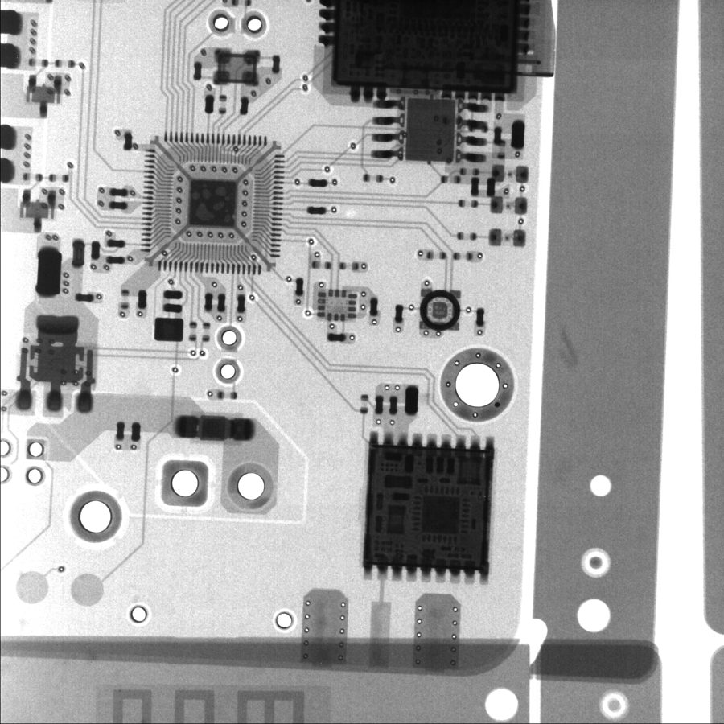
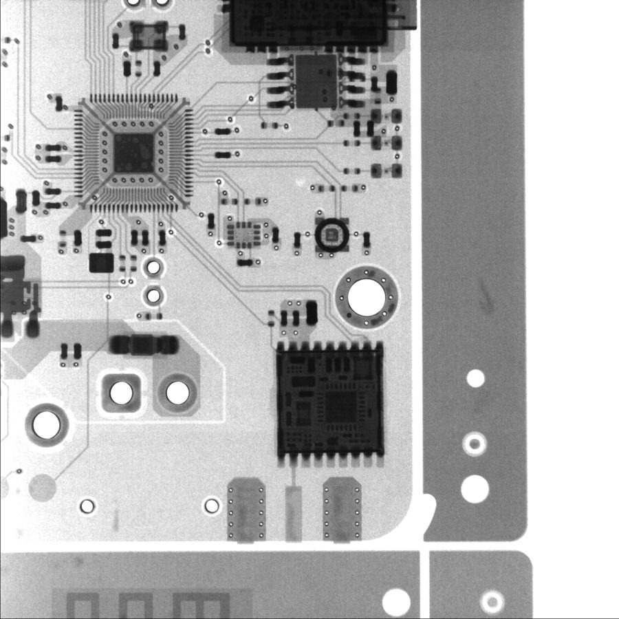
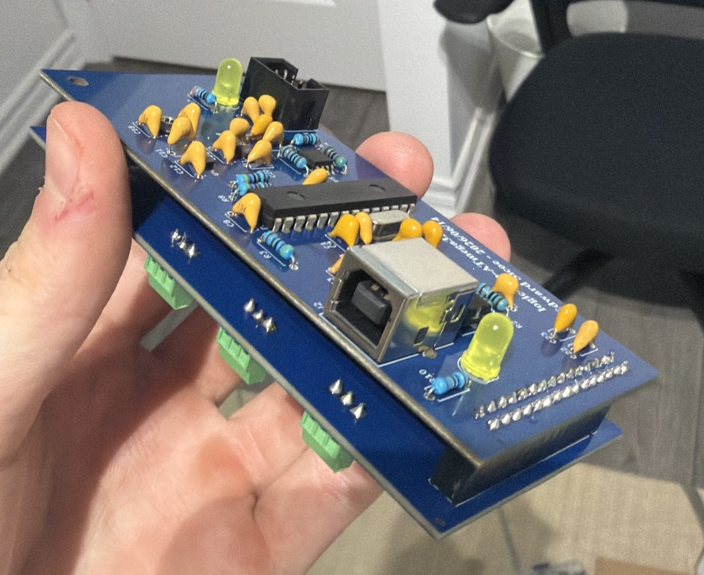
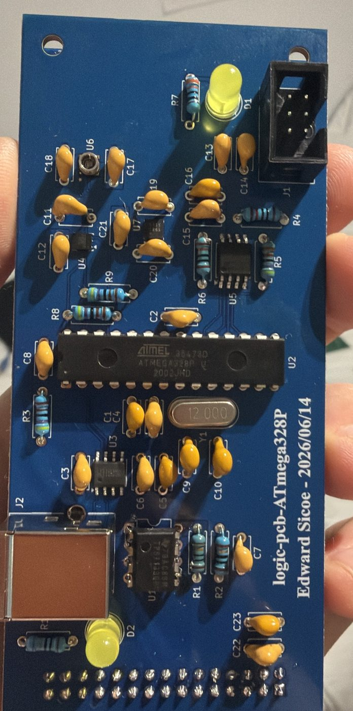
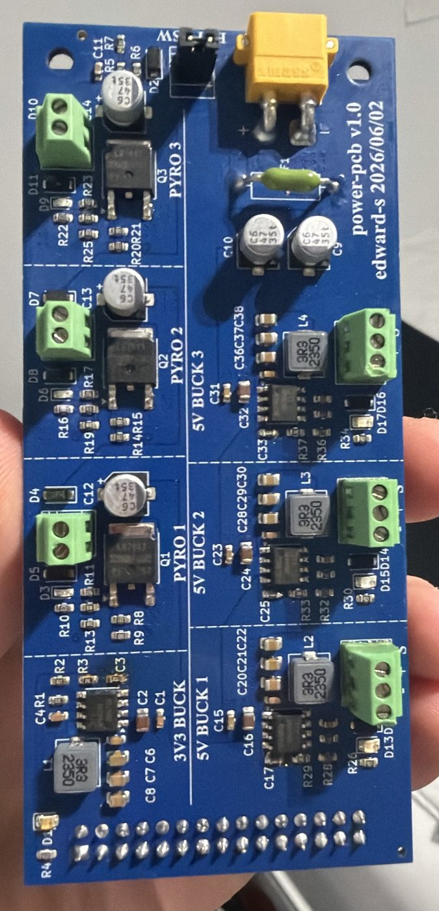
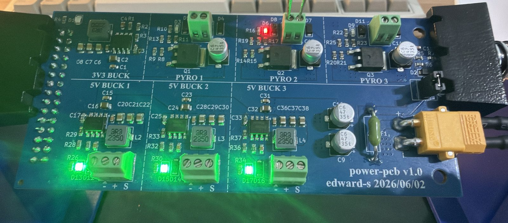

# mini-one: a high-power rocketry flight computer

  

mini-one is a 50 x 70 mm flight computer for high-power rocketry airframes of 54 mm and up. It carries the
sensors, storage, GPS, LoRa telemetry, pyro channels and servo outputs for a flight steered by thrust vector
control (TVC), and it's the second generation of my avionics platform.

## Status

| Version | State |
|---|---|
| **v2, mini-one** (this repo) | Schematic and 4-layer layout done. Fabricated and assembled by JLCPCB (X-rays below). Next: bring-up, then firmware |
| **v1, two-board stack** | Built and bench-tested in June 2026. See [Earlier versions](#earlier-versions) |

## Hardware (v2)

| | |
|---|---|
| MCU | Raspberry Pi RP2354B (dual Arm Cortex-M33), 12 MHz crystal |
| IMU | ST LSM6DSV32X, 6-axis, up to 32 g |
| Barometer | Bosch BMP585 |
| GNSS | u-blox MAX-M10S, edge-mount SMA antenna |
| Telemetry | RAKwireless RAK3172 LoRa module (868/915 MHz), edge-mount SMA antenna |
| Storage | Winbond W25Q128 (128 Mbit) SPI NOR flash, plus microSD |
| Pyro | 3 channels on AO3400A MOSFETs, continuity LEDs, pyro bus armed by an external switch (PY EN) |
| Servos | 2 outputs on JST-XH connectors, for TVC |
| Power | 2S LiFePO4 battery on XT30, diode-OR'd with USB (SS54), AMS1117 3.3 V regulator |
| USB | USB-B |
| PCB | 4 layers (signal / ground / power / signal), 50 x 70 mm, 100 parts placed by JLCPCB |

The schematic is split into five hierarchical sheets: processor, power and interface, sensors and memory, RF,
and outputs. Everything is in [`pcb/`](pcb), and the Gerbers, BOM and pick-and-place files are in
[`manufacturing/`](manufacturing).

## Firmware (in progress)

The plan splits the work across the RP2354B's two cores:

- **Core 0:** a deterministic loop for sensor fusion and the flight state machine.
- **Core 1:** data logging, GNSS parsing and LoRa telemetry.
- The two cores pass data through a lock-free ring buffer, so logging and radio never stall the flight loop.

## X-ray inspection

JLCPCB X-rayed the assembled boards to check the solder joints under the QFN and the modules. Click an image
for full resolution.

  
  

## Earlier versions

### v1: two-board stack (June 2026)

  

v1 split the flight computer into a logic board stacked on a power board, joined by a board-to-board pin header.

- **Logic board** (`logic-pcb-ATmega328P`, 2026-06-14). An ATmega328P at 12 MHz with a CH340 USB-to-serial
  bridge on USB-B, a W25Q32 SPI NOR flash, an ISP header and status LEDs, mostly in through-hole parts. The
  firmware is bare-metal C written from the datasheets, with no Arduino libraries: drivers for UART at 250 kbaud,
  I2C (TWI) and the SPI flash. It's built with avr-gcc and flashed with avrdude over a USBtinyISP.
- **Power board** (`power-pcb v1.0`, 2026-06-02). XT30 battery input with a fuse, a 3.3 V buck converter, three
  5 V buck converters (one per servo output), three pyro channels with continuity LEDs, and an enable jumper.

  
  

  
   <em>Power board on the bench: the three 5 V rails up (green) and a continuity check on PYRO 2 (red).</em>

Bring-up found two board-level bugs, and both were fixed by rework:

- A regulator enable pin that was wired wrong.
- A capacitor placed where a buck converter's frequency-setting resistor belonged.

### What changed from v1 to v2

| | v1 | v2 (mini-one) |
|---|---|---|
| Boards | Logic + power stack | One 4-layer board, 50 x 70 mm |
| MCU | ATmega328P (8-bit AVR) | RP2354B (dual Cortex-M33) |
| Radio and GNSS | Not on board | LoRa telemetry and u-blox GNSS |
| Assembly | Through-hole and SMD | 100 machine-placed SMD parts |
